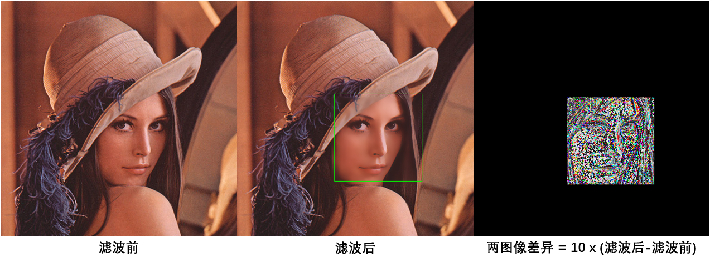
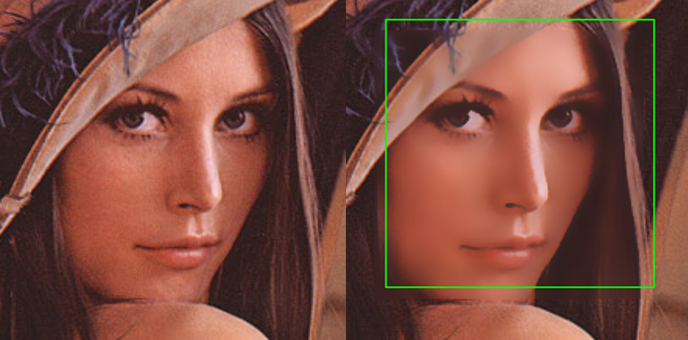
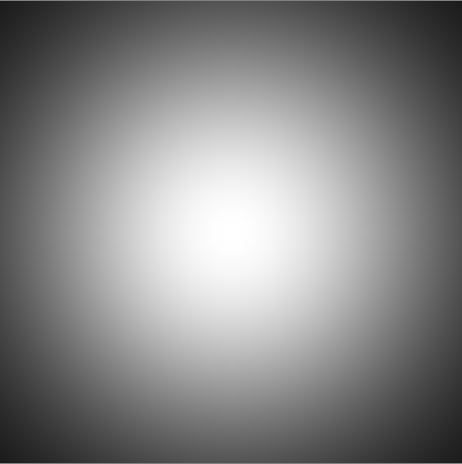

# 图像滤镜效果实现

## 一、人像美肤

### 1.1 运行环境

- Python 3.8.3
- NumPy 1.18.5
- OpenCV 4.4.0


### 1.2 运行步骤

1. 在控制台输入``cd SkinFilter``
2. 输入``python skinFilter.py``
3. 输入图片的路径，默认为``SkinFilter/data``文件中的``lenna.png``
4. 默认在``SkinFilter``文件夹输出结果图像``newimage.png``
5. 在``SkinFilter``文件夹输出原图像与结果图像之间的差异``difference.png``


### 1.3 算法原理

首先程序调用``detectFaces``函数检测图像中人脸的位置。该函数使用OpenCV提供的预训练模型进行检测。模型存放在``SkinFilter/haarcascade_frontalface_default.xml``文件中。函数返回一个``Rect``数组，每个``Rect``记录某个包围人脸的矩形的x和y坐标以及其宽高。

```python
def detect_faces(img, classifier_path):
    gray = cv2.cvtColor(img, cv2.COLOR_BGR2GRAY)
    classifier = cv2.CascadeClassifier(classifier_path)
    faces = classifier.detectMultiScale(gray)
    return faces
```


然后程序在每个人脸矩形区域进行双边滤波。

双边滤波同时考虑空域位置距离和灰度相似性，从而能够更好的保存图像的边缘信息。其公式如下：
$$
I^{filtered}(x) = \frac{1}{W_p} \sum_{x_i \in \Omega} f_r(||I(x_i) - I(x)||) g_s(||x_i - x||)
$$

$$
W_p = \sum_{x_i \in \Omega}f_r(||I(x_i) - I(x)||) g_s(||x_i - x||)
$$

其中：

- $$
  I^{filtered} 是滤波后的图像
  $$

- $$
  I 是原图像
  $$

- $$
  x 是当前要被滤波的像素坐标
  $$

- $$
  \Omega 是中心为 x 的窗口，即卷积核覆盖的区域
  $$

- $$
  f_r 是灰度核函数，用来平滑灰度的差异
  $$

- $$
  g_s 是空域核函数，用来平滑坐标位置的差异
  $$

在程序中，两个核函数都使用以下高斯函数：
$$
f(u) = \frac{1}{\sigma \sqrt{2 \pi}} e^{-\frac{u^2}{2 \sigma^2}}
$$
同时，超参数设为：

1. 卷积核大小设为10 X 10大小
2. 灰度核函数的 σ 设为25，空域核函数的 σ 设为25


### 1.4 算法效果

左边为滤波前效果；中间为滤波后效果；右边为滤波前与滤波后的差异。

为了更好显示滤波前后的差异，右图显示的差异是实际差异的10倍。



脸部细节对比：可以看到滤波后脸部皮肤更加光滑。




## 二、LOMO滤镜

### 2.1 运行环境
- Python 3.8.3
- NumPy 1.18.5
- OpenCV 4.4.0


### 2.2 运行步骤

1. 在控制台输入``cd LomoFilter``
2. 输入``python lomoFilter.py``
3. 输入图片的路径，默认为``LomoFilter/data``文件中的``lenna.png``
4. 默认在``LomoFilter``文件夹输出结果图像``newimage.png``


### 2.3 算法原理

#### 2.3.1 添加暗角

首先使用以下高斯函数获得图像的掩膜：
$$
I^{mask}(x) = f(||I(x) - I(x_{center})||)，其中x_{center}是图片中心点的坐标
$$

$$
f(u) = e^{-\frac{u^2}{2 \sigma^2}}
$$

在实现时，高斯函数的 σ 设为图片宽的1/3。




然后使用Overlay混合算法将掩膜和图像进行混合。Overlay算法的公式如下：
$$
f(a, b) =
\left\{
\begin{array}{}
2ab, & \text{if } a < 0.5 \\
1 - 2(1-a)(1-b), & \text{otherwise}
\end{array}
\right.
$$
其中，*a*表示底层、*b*表示顶层。

在实现时，将原图像设为底层，掩膜设为顶层，并将两图像颜色值范围缩放至[0,1]。


#### 2.3.2 颜色非线性拉伸

然后使用以下函数对颜色进行非线性拉伸，使亮的像素更亮，暗的像素更暗。

$$
y = \frac{1}{1 + e^{-\frac{x-0.5}{0.1}}}
$$


在实现时，为了加快运算速度，程序使用查表法预先存储每个``x``对应的``y``值。当处理图片时，只需要将当前像素值作为表的下标便可以获得结果值。


### 2.4 算法效果


### 2.5 参考资料

http://zihua.li/2014/06/implement-instagram-like-filters/

https://xta0.me/2013/11/20/iOS-Lomo-Effect.html

https://www.weiy.city/2020/10/lomo-graphy-by-opencv/

https://en.wikipedia.org/wiki/Blend_modes#Overlay