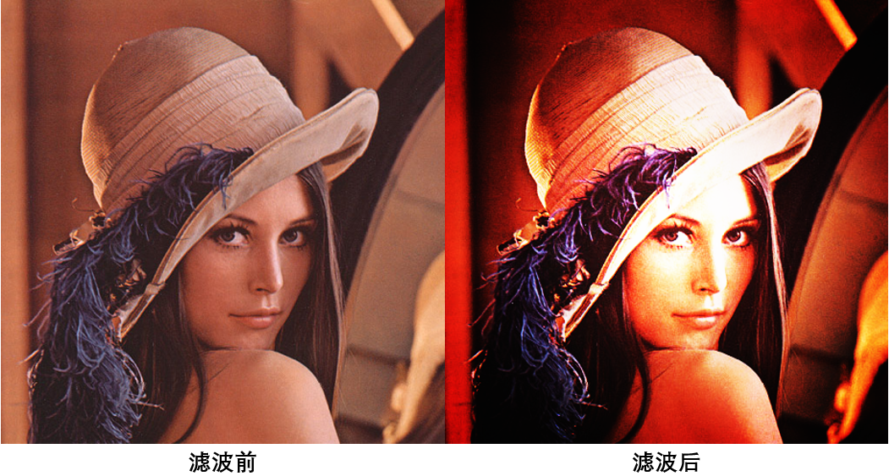

# 图像滤镜效果实现

## 一、人像美肤

### 1.1 运行环境

- OpenCV 4.5.0


### 1.2 运行步骤

1. 在控制台输入``cd SkinFilter``
2. 输入``./SkinFilter.exe``
3. 输入图片的路径，默认为``data``文件中的``lenna.png``
4. 默认在``SkinFilter``文件夹输出结果图像``newimage.png``
5. 在``SkinFilter``文件夹输出原图像与结果图像之间的差异``difference.png``


### 1.3 算法原理

首先程序调用``detectFaces``函数检测图像中人脸的位置。该函数使用opencv提供的预训练模型进行检测。模型存放在``SkinFilter/haarcascade_frontalface_default.xml``文件中。函数返回一个``Rect``数组，每个``Rect``记录某个包围人脸的矩形的x和y坐标以及其宽高。

```c++
void detectFaces(Mat &img, vector<Rect> &faces, String &classifierPath) {
    Mat gray;
    cvtColor(img, gray, COLOR_BGR2GRAY);
    CascadeClassifier classifier;
    classifier.detectMultiScale(gray, faces);
}
```

然后程序在每个人脸矩形区域进行双边滤波。

双边滤波同时考虑空域信息和灰度相似性，从而能够更好的保存图像的边缘信息。其公式如下：


## 二、LOMO滤镜

### 2.1 运行环境
- OpenCV 4.5.0


### 2.2 运行步骤

1. 在控制台输入``cd LomoFilter``
2. 输入``./LomoFilter.exe``
3. 输入图片的路径，默认为``data``文件中的``lenna.png``
4. 默认在``LomoFilter``文件夹输出结果图像``newimage.png``


### 2.3 算法原理

首先使用以下函数进行对比度拉伸，使亮的像素更亮，暗的像素更暗。

$$
y = \frac{1}{1 + e^{-\frac{x-0.5}{0.1}}}
$$


在实现时，为了加快运算速度，程序使用查表法预先存储每个``x``对应的``y``值。当处理图片时，只需要将当前像素值作为表的下标便可以获得结果值。


然后在与图像大小相同的区域的中间绘制一个圆，半径为图像宽与高之间最小值的1/3。之后使用盒式滤波器对绘制的圆进行滤波，滤波器核的大小为图像宽与高之间最小值的1/2。

在实现时，为了加快运算速度，程序利用盒式滤波器核可分离的性质。这样就只需用计算两次向量与矩形的乘积便可获得卷积的结果。

$$
\frac{1}{9}
\left[
\begin{matrix}
1 & 1 & 1\\
1 & 1 & 1\\
1 & 1 & 1\\
\end{matrix}
\right]
= \frac{1}{9}
\left[
\begin{matrix}
1 \\
1 \\
1 \\
\end{matrix}
\right] 
\times
\left[
\begin{matrix}
1 & 1 & 1 \\
\end{matrix}
\right]
$$

最后将卷积结果和对比度拉伸结果进行乘积，获得最终结果。

### 2.4 算法效果

